# Practikum 1
* Step 1

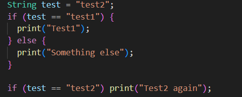

* Step 2

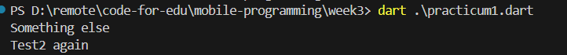
* Step 3

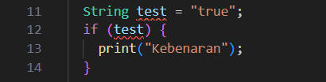

The code give an error, so the correction is :

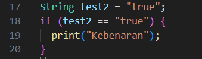

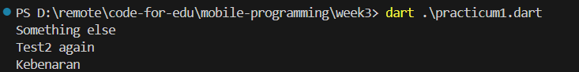

# Practicum 2
* Step 1

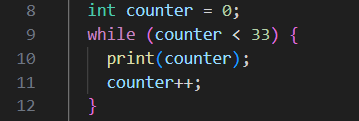

* Step 2

The code will print a number from 0 to 32

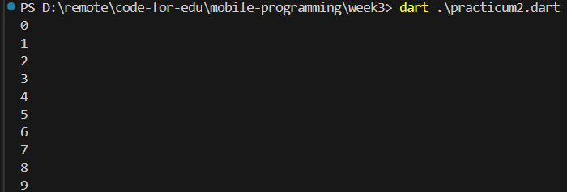

* Step 3

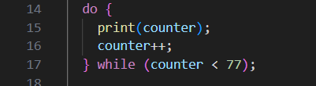

The code will continue print a number until the number reach < 77 that is 76

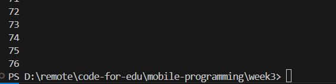

# Practicum 3

* Step 1

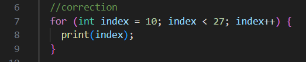

* Step 2

The code will print a number from 10 into 26 because < 26 using for-loop statements

* Step 3

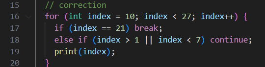

Since the `else if (index > 1 || index < 7)` condition is always true, no index value will be printed before the loop stops at index == 21.

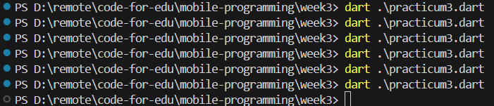

# Practicum Task

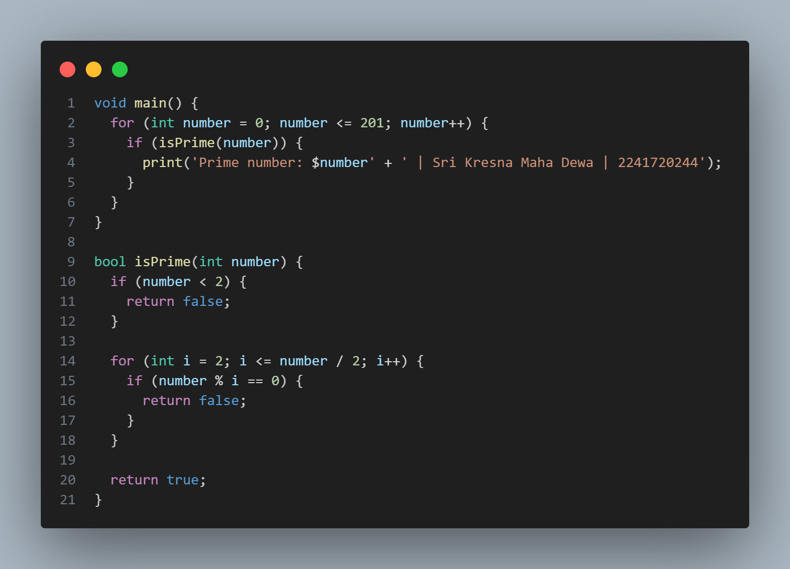